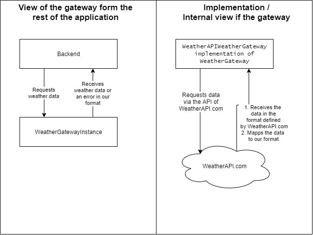

# Gateway 

## Definition
> The intent of a gateway is to wrap all the special API code of external services into a class whose interface looks like a regular object. Other objects access the resource through this Gateway, which translates the simple method calls into the appropriate specialized API.

@hauks96 from [Design_Patterns_Fitcoin_Implementation.pdf](Design_Patterns_Fitcoin_Implementation.pdf)

## Use within the project

### Weather API
The user story #52:

> As a user I would like to see what the weather is like today, so I can decide what exercise I'm doing

We've decided to use an external service to provide the data for the display. However, we don't want to be dependent on a single service and their format. We choose the gateway pattern to access the service of _WeatherAPI_. The service is internally represented as a subclass of the `WeatherGateway` interface in `workoutapp/weather_service/gateway/weather_gateway.py`. The received data gets mapped to predefined data structures in `workoutapp/weather_service/gateway/weather_data.py`.

This figure illustrates the view of the gateway and the internal workings of the WeatherAPIWeatherGateway. It also shows the advantages of the `Separated Interface` design pattern. We could in theory replace the WeatherAPI with a different api if we implement the same `WeatherGateway` interface. The rest of the backend should be unaffected as it only references the interface methods.

