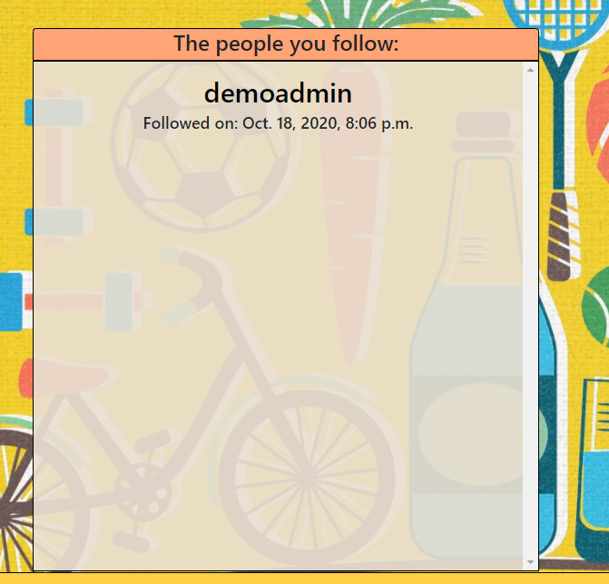

# Interface Demo
This is a small demonstration of our current interface. There's alot of styling left to be done but has 
been improved upon alot since last sprint.

### Dashboard
The dashboard is the landing page and displays public workouts.

The exercise and workout views can be flipped between using the buttons at the top e.g 'Workout' and 'Exercise'.

#### Choose between
You can choose between seeing your own exercises/workouts or the ones made public my other users. The following showing
only exercises created by the logged in user. (Yes some feedback missing on the pressed buttons as of right now)

#### Categories
You can filter between categories in workout and filter between muscle groups in exercises. These are all dynamically
added according to data available in the database.

#### Order By
You can order the exercises/workouts displayed on the current page according to multiple options.

#### Search for
Filter the available workouts/exercises on the current page by search entry.

### Profile
(Still needs some work)
Every user has a profile.

#### Friends list
Every user has a friends list available from the profile

#### Followers
Users have an option to follow other users

#### Other people's profile
Users can visit other peoples profiles. (Donate button, Add friend and follow button coming soon)

### Wallet
(still needs work)
Users have wallet in which they can see their fitcoin balance

#### Purchase fitcoins
Users can top up their wallet by purchasing fitcoins

#### Checkout page
User purchase checkout

#### Paypal
When checking out the user is redirected to a paypal checkout window

#### Payment Confirmation
When the purchase is complete the user get's redirected to a success page.
