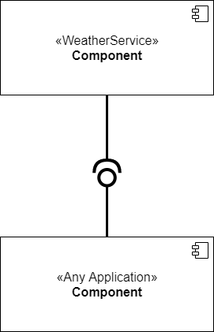

# Components
An individual software component is a software package, a **web service**, a **web resource**, or a **module/package** 
that encapsulates a set of related functions (or data). Components communicate with each other via interfaces (API)
and should be independently replaceable and removable.

### Why use components?
An important feature of components is the emphasis on separation of concern.
They are a reuse-based approach to defining, implementing and composing loosely coupled independent software
into systems. This allows for better management, easier decoupling and simpler future upgradability.

# Implementation 1: Weather Service
The weather service is a software package that serves up it's functionality using an interface. It's purpose is to 
fetch weather data from an external web service and offering methods of retrieving them. The weather service can be
easily decoupled since it is very much independent and directly unrelated to other applications of the system.
It's functionality is documented through the weather api class.

- Independent
- Upgradable
- Loosely coupled
- Reusable
- Communication through interface
- Documented functionality

# Implementation 2: Logging Server
In the most recent version of our system we have a completely separated component which functions
as a logging server. In it's current state it allows for logging actions made in the front end to a database.
It can be used where desired in the frontend by adding an 'lid' attribute to an html element and
including the [supplemented javascript](workoutapp/static/logging.js). This has been further documented in the logging 
readme [README.md](logging_server/README.md). It is very reusable and can be decoupled by either removing the js or the 
lid attribute. Furthermore it can be easily upgraded, even on a live server without having an impact on the software 
using it's services.

- Completely separate
- Very expandable
- Reusable
- Web service
- Easily decoupled
- Simple integration
- Documented functionality