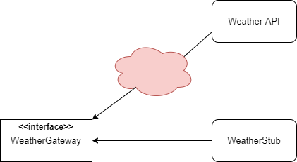

# Service stub
We have integrated a new interface called WeatherGatewayStub that serves as a service stub for the weather api. 
This interface replaces the weather api when necessary and does not rely on the external service. It returns
hardcoded data and is therefore reliable, fast and runs in memory.

